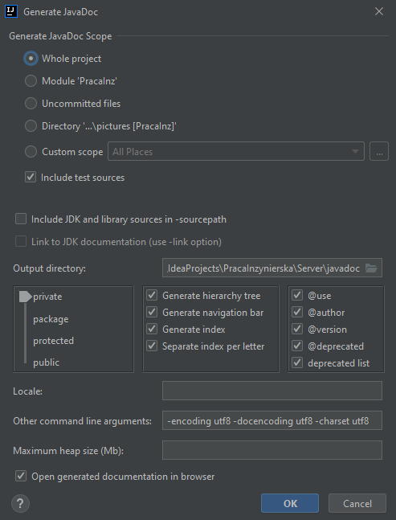

# Anime Web Application

# Table of Contents

- [General Information](#General-Information)
- [File Structure for Backend](#File-Structure-for-Backend)
- [Main Technologies](#Main-Technologies)
- [Launch](#Launch)
- [Generating the documentation](#Generating-the-documentation)
- [Needed environmental variables](#Needed-environmental-variables)
- [Plans for future](#Plans-for-future)

# General Information
## General

This is a web application created for my Bachelor's Degree. It's one of 2 parts - [link to Frontend here](https://github.com/TheSausages/Anime_Web_Application-Fronend "FrontEnd").
The main desire for creating this app was to enable both Polish and international users to access information and discuss Anime.
Users would be able to find selected anime, get detailed information on it and, if they want to, discuss it with others. 

## Backend specific

The aim for the backend portion was to create a server available from both pc and phone.
This way it can be used for both the web app and a future mobile application.
This app uses [Anilist GraphQl Api](https://anilist.gitbook.io/anilist-apiv2-docs/ "Anilist GrapgQl Api") in order to acquire Anime information.
Additionally, it offers several functions, such as a build-in forum or the ability to earn achievements.

# File Structure for Backend

The structure should at least consist of these files and folders:
1) .run - run configurations
2) docker - files needed to run the application
3) src - folder with code
4) .editorconfig
5) build.gradle - list of needed dependencies
6) Dockerfile - file needed to run this app fully using docker

Additionally, if Frontend is used, both front- and backend folders must be in the same folder and have the names:
- *Any Name* - for backend
- *ReactFrontEnd* for frontend

If the frontend folder has any other name, please change the *ReactFrontEnd* value to the correct value in the *gradle.build* file.

# Main Technologies

- Intellij Idea Ultimate 
- Java 14
- MySql Database 8.0.26
- Keycloak 15.0.0
- Docker 20.10.8
- Gradle 7
- Spring Boot 2.5.3
- Spring Component, all version 2.5.3:
  - Data
  - Security
  - Web & Webflux
  - Validation
  - Configuration Processor
- Keycloak Spring Boot Starter 15.0.0
- Lombok
- For testing purposes:
  - Junit 5
  - TestContainers 1.16.2
  - Wiremock 2.31.0

# Launch

Remember! Change the option: file -> setting -> editor -> file encoding -> properties files to use `UTF-8` encoding
and check the `Transparent native-to-ascii conversion`. This way the translation files won't be damaged.

In order to launch the app these technologies are __needed__:
- docker
- gradle 7
- java 14

__Important!__
The easiest way to run the applications using Intellij Idea. It is highly recommended to using it.

*For all configurations* - Docker is used to create the database and Keycloak instances. All needed Keycloak information, such as realms and test users,
are loaded automatically when starting the server using the predefined run methods.
All commands should be run from the __[main server folder](/)__.

3 composite run configurations are defined in order to make the app easier to use.

1) *Local server without frontend serving* - Most basic way to run the app. Consist of 2 parts:
   - Keycloak and MySql are run using Docker.,
   - The server is run locally using the IDE. All needed environmental variables are defined in the run config 
   (full list can be found [here](#Needed-environmental-variables)). It is recommended to clean before running
     if frontend was served before using this option. Cleaning can be done using:
    ```shell
   gradle clean
    ```
    No frontend is started when using this configuration. This configuration consists of running 2 commands:
    ```shell
   docker-compose -f docker/docker-compose-local.yml up --build
    ```
   Which starts the Keycloak and Mysql, and the application configuration *Praca Inzynierska without Static Content*.


2) *Local server with frontend servin*g - This method additionally server the frontend as static files.
In order to use this configuration the frontend application would need to be build ([more here](/)). Also consists of 2 parts:
    - Keycloak and MySql are run using Docker (same as option 1),
    - The server is run locally using the IDE. All needed environmental variables are defined in the run config
     (full list can be found [here](#Needed-environmental-variables)),
   
   Docker is run using the same command as in option 1, but the *Local server serves react app static files* configuration is used.


3) *All elements run in docker* - This configuration runs the server using docker, with frontend serving enabled.
Same as version 2, the frontend will be build (just make sure the folder structure is correct, [more here](#File-Structure-for-Backend)).
In order to run this configuration run the shell script [*run.sh*](/docker/scripts/run.sh). The best way to run it is using 
the predefined run configuration *All elements run in docker*.

It is possible that some problems might occur with the tests. If this happens, please *Disable* these tests.
   
# Generating the documentation

In order to generate the documentation run this command:
```shell
gradle generateJavadocs
```
The documentation is now available in the *javadoc* folder. Start with the *index.html* file.

The other way is use the IDE builds-in tools. For Intellij idea this would be:
1) Click 'Tools' on the menu at the top of the screen
2) Click 'Generate Javadoc' 
3) Select:
    - 'Whole Project' Scope
    - 'private' visibility
    - All checkboxes next to visibility
    - add '-encoding utf8 -docencoding utf8 -charset utf8* to the command line




# Needed environmental variables

In order to run the app standalone these environmental variables are needed:
- SPRING_PORT - default *8080*
- ANILIST_API - default *https://graphql.anilist.co*
- DATABASE_URL - default *localhost:3307*
- KEYCLOAK_URL - default *localhost:8180*
- BACKEND_API_BASE_PATH - default */api*

Additionally, if frontend should be served as static content:
- SERVE_STATIC_CONTENT: __must__ use the value *serve*


# Plans for future

- add openapi 3 for endpoint (using https://github.com/springdoc/springdoc-openapi#integration-of-the-library-in-a-spring-boot-2xx-project-without-the-swagger-ui)
- make sure mock data is concise (all data makes sense)
- check if all services update all necessary information
- make backend calls cancelable (front)
- Add user picture (together with frontend)
- add sort by for both queries (together with frontend)
- Adjust dto to whats needed (together with frontend)

# Miscellaneous

The default achievement icon was made by [Made by Made](https://www.flaticon.com/authors/made-by-made) perfect
from [www.flaticon.com](www.flaticon.com "flaticon")